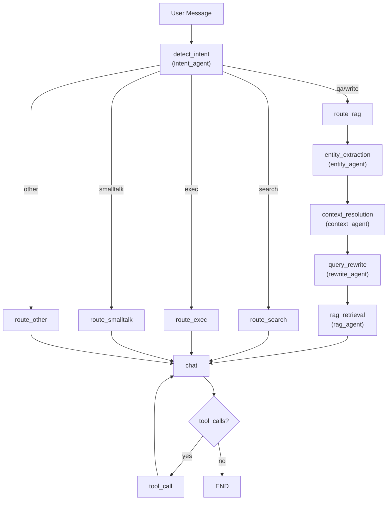

## Agent 架构与流水线说明

本说明文档梳理了“前台 Agent”（与用户交互）在本项目中的分层与编排方式，强调“一个图一个文件、职责单一、主图编排”的实践。

### 目标
- 意图理解：识别用户问题的真实意图，输出标准化标签与置信度。
- 多轮对话理解：对省略与指代进行补全与继承（如“上个月的呢？”继承上一轮主题）。
- 可检索可执行：将口语问题改写为明确、结构化的查询；对接 RAG 检索获取依据。

### 总览
- 主编排（Chief）：`app/core/agent/graph/chief_agent.py`
  - 入口：`detect_intent`
  - 路由：根据 `state.intent` 进入不同子图
  - RAG 路径：`entity_extraction -> context_resolution -> query_rewrite -> rag_retrieval -> chat -> tool_call -> chat`
- 子图：
  - 意图识别：`app/core/agent/graph/intent_agent.py`
  - 实体抽取：`app/core/agent/graph/entity_agent.py`
  - 上下文/指代消解：`app/core/agent/graph/context_agent.py`
  - 查询改写：`app/core/agent/graph/rewrite_agent.py`
  - RAG 检索：`app/core/agent/graph/rag_agent.py`

### 流程细节
1) 意图识别（Intent）
   - 输入：最新 user 消息
   - 输出：`state.intent`, `state.intent_confidence`
   - 配置：`app/configs/agent_config.py` 中的 `INTENT_LABELS` 与 `INTENT_DESCRIPTIONS`

2) 实体抽取（Entity）
   - 输入：最新 user 消息
   - 输出：`state.entities`（如 subject/filters）、`state.time_text`（如“上周/上个月”）

3) 上下文/指代消解（Context）
   - 输入：`entities`, `time_text`, 历史 `context_frame`
   - 输出：`state.context_frame`（包含 subject/filters/time_range）、`state.time_range`（绝对区间）
   - 作用：多轮补全与继承，如“上个月的呢？”继承上一轮 `subject`、仅替换时间

4) 查询改写（Rewrite）
   - 输入：`context_frame`、最新 user 消息
   - 输出：`state.rewritten_query`
   - 目标：生成可用于检索/执行的明确查询

5) RAG 检索（RAG）
   - 输入：`rewritten_query`（无则回退最新 user 消息）、`doc_names`
   - 过程：多查询扩展 → Qdrant 检索 → 重排
   - 输出：`state.context_docs`（TopK 段落），并注入一条 system 消息承载上下文

6) Chat 与 Tool 调用
   - `chat`：根据 `messages`（含系统上下文）调用 LLM 生成答案
   - `_should_continue`：若存在工具调用，走 `tool_call -> chat` 回环

### GraphState 作为“共享状态容器”
`app/models/graph.py` 定义以下关键字段，用于子图间传递：
- 基础：`messages`, `session_id`
- 意图：`intent`, `intent_confidence`
- 语义槽位：`entities`, `time_text`, `time_range`, `context_frame`
- 检索/生成：`rewritten_query`, `context_docs`, `doc_names`

### 配置与默认值
- `app/configs/agent_config.py`
  - `INTENT_LABELS`, `INTENT_DESCRIPTIONS`
  - `RAG_DEFAULT_DOC_NAMES`（未显式指定 `doc_names` 时的默认集合）
- `app/pipeline/inference_pipeline/config.py`
  - `TOP_K`, `KEEP_TOP_K` 等检索参数

### 为什么拆成多个子图
- 单一职责、易维护：每个文件只管理一个清晰步骤
- 易复用：例如 search/exec 的路径也可重用 `entity` / `context` / `rewrite`
- 易测试：为每个子图编写独立单测与集成测试
- 可扩展：在 `chief_agent.py` 中增删路由，不影响已实现子图

### 调试建议
- 在各子图末尾打印/断点 `GraphState` 变化：
  - `entity` 后应看到 `entities/time_text`
  - `context` 后应看到 `context_frame/time_range`
  - `rewrite` 后应看到 `rewritten_query`
  - `rag` 后应看到 `context_docs` 与注入的 system 消息

### 测试
- 单元测试：`test/agent/test_intent_agent.py`（意图识别）
- 集成测试（最小账单场景，多轮）：`test/agent/test_rag_pipeline.py`

### 可选聚合
- 如需精简主图节点，可新增 `rag_pipeline_agent.py` 将 `entity/context/rewrite/rag` 聚合为一个子图节点；主图仅挂该节点。

### 编排流程图（Mermaid）

节点读/写（GraphState）：
- detect_intent: 写 `intent`, `intent_confidence`
- entity_extraction: 写 `entities`, `time_text`
- context_resolution: 读 `entities/time_text/context_frame`，写 `context_frame`, `time_range`
- query_rewrite: 读 `context_frame/messages`，写 `rewritten_query`
- rag_retrieval: 读 `rewritten_query/doc_names`，写 `context_docs`，并注入承载上下文的 system 消息
- chat / tool_call: 基于 `messages` 生成与工具回路

