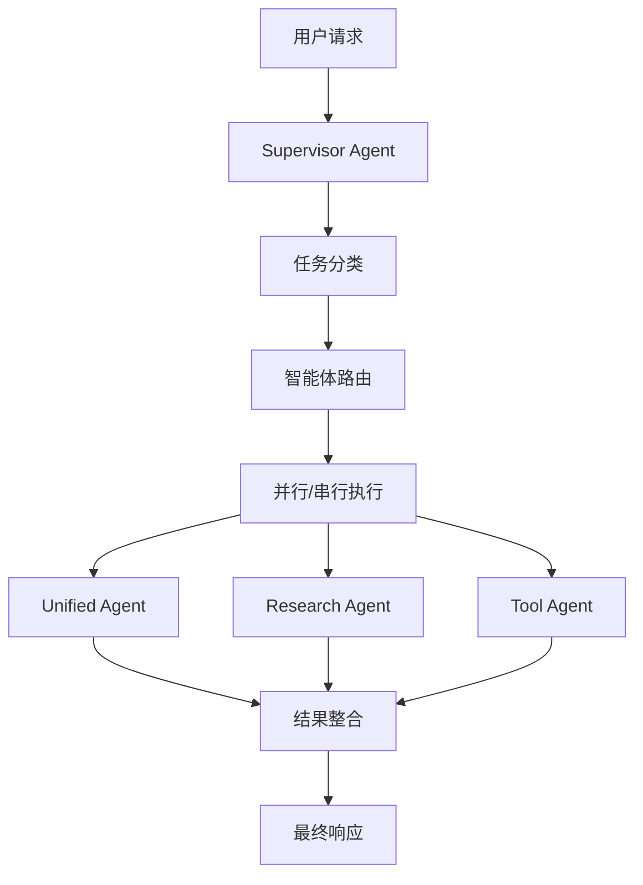

# 🎯 Supervisor-Based Multi-Agent System

## 概述

基于 [open_deep_research](https://github.com/langchain-ai/open_deep_research) 的 supervisor 架构设计，MiniCascade-RAG 现在支持智能的多智能体调度系统。该系统能够根据任务类型和复杂度，智能地将任务路由到最适合的专业智能体。

## 🏗️ 系统架构

### 核心组件



### 智能体类型

#### 1. **Supervisor Agent** (总控智能体)
- **职责**: 任务分类、智能体路由、执行协调
- **功能**: 
  - 基于关键词和 LLM 的任务分类
  - 智能路由决策
  - 并行/串行执行管理
  - 结果整合

#### 2. **Unified Agent** (统一智能体)
- **职责**: 通用问答、意图检测、RAG 检索
- **适用场景**: 
  - 简单问答
  - 一般性查询
  - 需要上下文感知的任务

#### 3. **Research Agent** (研究智能体)
- **职责**: 深度研究、分析、综合信息收集
- **适用场景**:
  - 复杂研究任务
  - 比较分析
  - 深度调查

#### 4. **Tool Agent** (工具智能体)
- **职责**: 工具密集型操作、数据处理
- **适用场景**:
  - 数据分析
  - 文件操作
  - API 交互

## 🧠 任务分类系统

### 分类类型

1. **simple_qa**: 简单问答
   - 直接事实性问题
   - 简单解释
   - 基础信息请求

2. **complex_research**: 复杂研究
   - 多方面研究问题
   - 比较分析
   - 深度调查

3. **multi_step**: 多步骤任务
   - 有依赖关系的工作流
   - 分步骤过程
   - 基于前序结果的任务

4. **tool_heavy**: 工具密集型
   - 数据分析和处理
   - 文件操作
   - 外部 API 交互

### 分类方法

#### 1. 关键词匹配 (快速分类)
```python
TASK_CLASSIFICATION_KEYWORDS = {
    "simple_qa": ["什么是", "谁是", "何时", "哪里", "多少", "定义"],
    "complex_research": ["分析", "比较", "研究", "调查", "综合", "详细分析"],
    "multi_step": ["步骤", "工作流", "流程", "如何", "首先", "然后"],
    "tool_heavy": ["计算", "处理数据", "分析文件", "生成报告"]
}
```

#### 2. LLM 分类 (精确分类)
- 当关键词匹配置信度低时启用
- 使用结构化输出确保一致性
- 提供分类推理过程

## 🚀 使用方法

### 基本使用

```python
from app.core.agent.graph.supervisor_agent import build_supervisor_graph
from langchain_openai import ChatOpenAI

# 初始化 LLM
llm = ChatOpenAI(model="gpt-4", temperature=0.7)

# 构建 supervisor 图
supervisor_graph = build_supervisor_graph(llm)

# 执行任务
result = await supervisor_graph.ainvoke({
    "messages": [{"role": "user", "content": "请研究AI发展趋势"}],
    "session_id": "session-123"
})
```

### 配置选项

```python
from app.core.agent.supervisor_config import SupervisorConfig

config = SupervisorConfig(
    simple_qa_threshold=0.8,
    complex_research_threshold=0.7,
    prefer_parallel_execution=True,
    max_parallel_agents=3
)
```

## 📊 性能特性

### 智能路由

- **关键词匹配**: 毫秒级快速分类
- **LLM 分类**: 高精度分类 (置信度 < 0.3 时启用)
- **回退机制**: 确保系统稳定性

### 执行模式

- **串行执行**: 适用于有依赖关系的任务
- **并行执行**: 适用于独立子任务
- **混合执行**: 根据任务特性动态选择

### 容错机制

- **分类失败回退**: 默认使用 unified_agent
- **路由失败处理**: 智能降级策略
- **执行错误恢复**: 详细错误日志和状态跟踪

## 🔧 配置和扩展

### 添加新智能体

1. **创建智能体图**:
```python
def build_new_agent_graph(llm) -> CompiledStateGraph:
    # 实现智能体逻辑
    pass
```

2. **更新配置**:
```python
# 在 supervisor_config.py 中添加
"new_agent": AgentProfile(
    name="new_agent",
    capabilities=[AgentCapability.CUSTOM],
    max_parallel_tasks=2,
    priority_weight=0.9
)
```

3. **集成到 supervisor**:
```python
# 在 supervisor_agent.py 中添加工作节点
graph.add_node("new_agent_worker", _new_agent_worker)
```

### 自定义分类规则

```python
# 扩展关键词分类
CUSTOM_KEYWORDS = {
    "custom_task": ["自定义", "特殊", "专门"]
}

# 或实现自定义分类器
def custom_classifier(user_input: str) -> Dict[str, float]:
    # 自定义分类逻辑
    return {"custom_task": confidence_score}
```

## 📈 监控和调试

### 日志记录

系统提供详细的结构化日志：

```python
logger.info("task_classified", 
           task_type=task_type, 
           confidence=confidence,
           reasoning=reasoning)

logger.info("task_routed", 
           assignments=assignments,
           execution_mode=execution_mode)

logger.info("agent_completed", 
           agent_name=agent_name, 
           assignment=assignment)
```

### 性能指标

- 任务分类准确率
- 路由决策时间
- 智能体执行成功率
- 端到端响应时间

## 🧪 测试和验证

### 运行测试

```bash
# 运行所有 supervisor 测试
python -m pytest test/agent/test_supervisor_agent.py -v

# 运行演示脚本
python examples/supervisor_demo.py
```

### 测试覆盖

- ✅ 任务分类准确性
- ✅ 智能体路由正确性
- ✅ 错误处理和回退
- ✅ 并行执行协调
- ✅ 结果整合

## 🔮 未来扩展

### 计划功能

1. **动态负载均衡**: 根据智能体负载动态调整路由
2. **学习型路由**: 基于历史性能优化路由决策
3. **多模态支持**: 支持图像、音频等多模态输入
4. **分布式执行**: 支持跨节点的智能体分布式执行

### 优化方向

1. **性能优化**: 减少路由延迟，提高并行效率
2. **准确性提升**: 改进任务分类算法
3. **可观测性**: 增强监控和调试能力
4. **易用性**: 简化配置和扩展流程

## 📚 参考资料

- [open_deep_research](https://github.com/langchain-ai/open_deep_research) - 原始 supervisor 架构
- [LangGraph Documentation](https://langchain-ai.github.io/langgraph/) - 图构建框架
- [LangChain Documentation](https://python.langchain.com/) - LLM 集成框架
